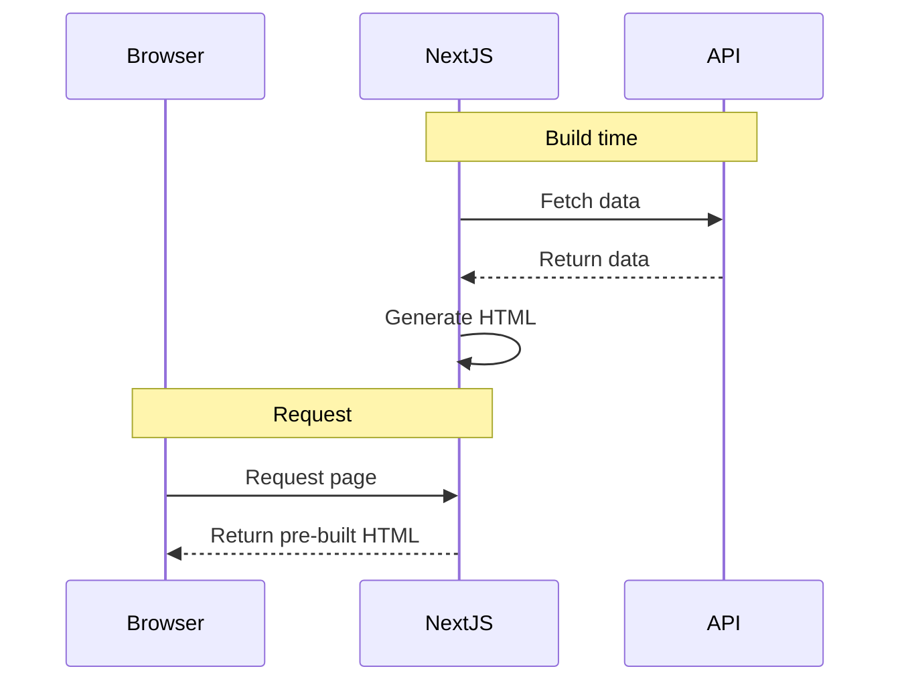
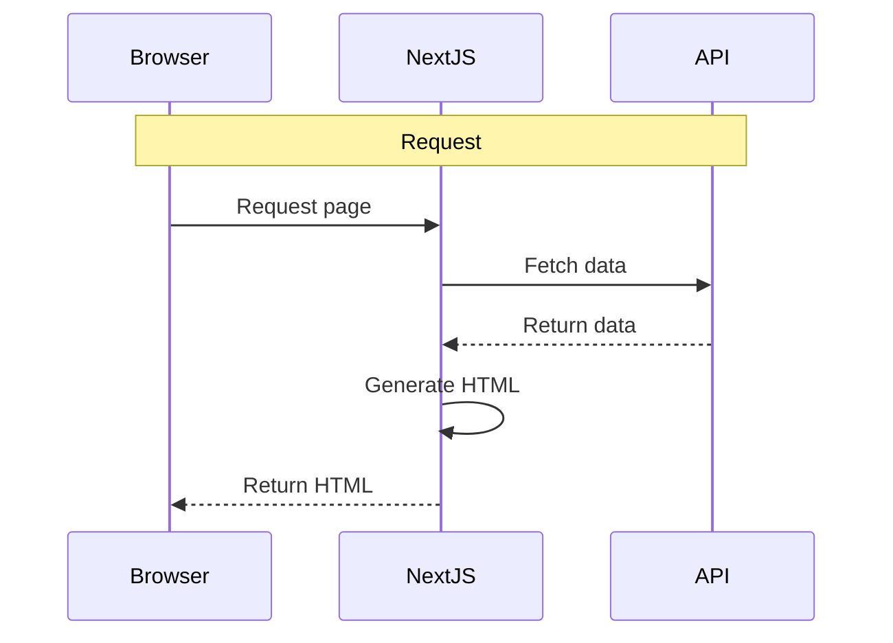
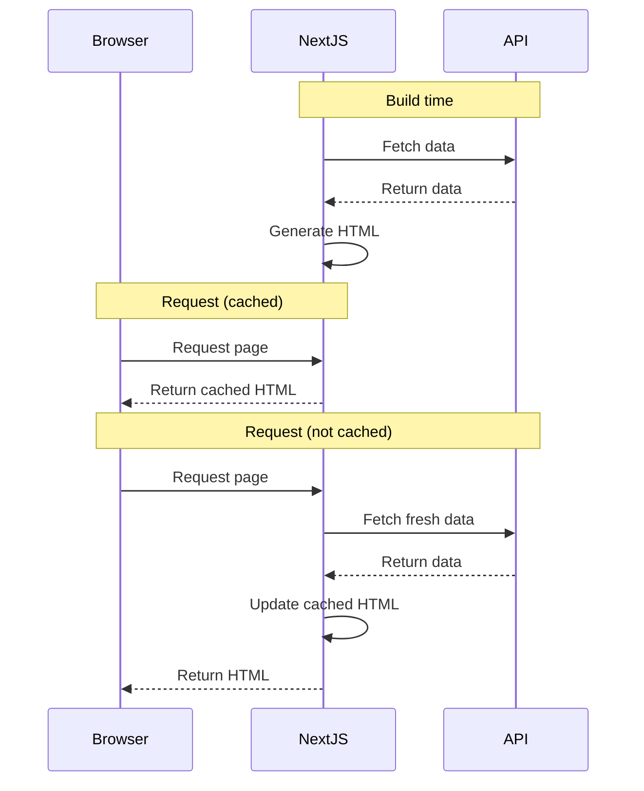

# API Communication in Next.js

## Introduction

**Goal:** Learn how to communicate with APIs effectively in Next.js while leveraging server-side principles.

**The Problem:** If you've worked with client-side frameworks like Vite/React, you're used to fetching data in `useEffect` or React Query. In Next.js App Router, we have a different paradigm — we can (and should) fetch data directly on the server.

**Why it matters:**

- Move data fetching from client to server → smaller bundle, faster page load
- Leverage Next.js caching → reduce API calls, improve performance
- Better SEO, better user experience
- Use Server Actions for mutations → no need for manual API endpoints

## API Query

### SSG (Static Site Generation)

**Mechanism:** Pages are rendered to HTML at build time. The HTML is generated once and reused for all requests.

**Use cases:**

- Marketing pages, landing pages
- Blogs, documentation
- Product listings that don't change often

### Flow



### Example

```tsx
// app/ssg/page.tsx
async function fetchAPI() {
  const res = await fetch("https://api.example.com/data");
  return res.json();
}

export default async function SSGPage() {
  const data = await fetchAPI();

  return <div>{data.content}</div>;
}
```

### SSR (Server-Side Rendering)

**Mechanism:** Pages are rendered on the server for each request. HTML is generated fresh on every request.

**Use cases:**

- Personalized dashboards
- Real-time data (stock prices, live scores)
- User-specific content

### Flow



### Example

```tsx
// app/ssr/page.tsx
export const dynamic = "force-dynamic";

async function fetchAPI() {
  const res = await fetch("https://api.example.com/data");
  return res.json();
}

export default async function SSRPage() {
  const data = await fetchAPI();

  return <div>{data.content}</div>;
}
```

**Alternative:** Use `cache: "no-store"` in fetch options.

```tsx
const res = await fetch("https://api.example.com/data", {
  cache: "no-store",
});
```

### ISR (Incremental Static Regeneration)

**Mechanism:** Pages are generated at build time but can be updated in the background after a specified interval. Combines static performance with dynamic updates.

**Use cases:**

- E-commerce product pages
- News articles
- Content that updates periodically

### Flow



### Example

```tsx
// app/isr/page.tsx
// Primary method: use revalidate config
export const revalidate = 60;

async function fetchAPI() {
  const res = await fetch("https://api.example.com/data");
  return res.json();
}

export default async function ISRPage() {
  const data = await fetchAPI();

  return <div>{data.content}</div>;
}
```

**Alternative:** Use `next: { revalidate }` in fetch options.

```tsx
const res = await fetch("https://api.example.com/data", {
  next: { revalidate: 60 },
});
```

### Comparison: SSG vs SSR vs ISR

| Feature           | SSG (Static)           | SSR (Dynamic)       | ISR (Revalidate)          |
| ----------------- | ---------------------- | ------------------- | ------------------------- |
| **Build time**    | Yes                    | No                  | Yes (initial)             |
| **Runtime fetch** | No                     | Yes                 | Yes (background)          |
| **Freshness**     | Stale until build      | Always fresh        | Fresh after revalidation  |
| **Speed**         | ❯❯❯ Fastest            | ❯ Slowest           | ❯❯ Fast (cached)          |
| **Server cost**   | $ Lowest               | $$ Highest          | $ Low                     |
| **CDN cache**     | Yes                    | No                  | Yes                       |
| **Cache control** | `cache: 'force-cache'` | `cache: 'no-store'` | `next: { revalidate: N }` |
| **Best for**      | Static content         | Real-time data      | Periodic updates          |

### How Next.js determines rendering type

Next.js automatically chooses between **SSG**, **ISR**, and **SSR** based on your code.

| Type    | When                          | Cache     |
| ------- | ----------------------------- | --------- |
| **SSG** | Default fetch (`force-cache`) | Forever   |
| **ISR** | Positive revalidate           | N seconds |
| **SSR** | Dynamic features detected     | No cache  |

**SSG** (Static Site Generation) - cached forever:

```tsx
fetch(url); // default
fetch(url, { cache: "force-cache" });
```

**ISR** (Incremental Static Regeneration) - cached for N seconds:

```tsx
export const revalidate = 60;
fetch(url, { next: { revalidate: 60 } });
```

**SSR** (Server-Side Rendering) - no cache:

```tsx
export const dynamic = 'force-dynamic'
fetch(url, { cache: 'no-store' })
cookies(), headers()
searchParams prop
```

## API Mutation

### Approaches Overview

| Approach                              | Pros                                                 | Cons                                                                    |
| ------------------------------------- | ---------------------------------------------------- | ----------------------------------------------------------------------- |
| **Pure Server-Side (Server Actions)** | Works without JS                                     | No loading states, no optimistic updates, UI updates on next navigation |
| **Client-Side + Server Actions**      | Loading states, optimistic updates, instant feedback | Requires JS, more complex                                               |

### Pure Server-Side (Server Actions + revalidatePath)

This approach uses only Server Actions without any client hooks. Works with progressive enhancement (works without JavaScript).

```tsx
// app/actions.ts
"use server";

export async function createPost(formData: FormData) {
  const title = formData.get("title");

  // 1. Mutate database
  await db.post.create({ title });

  // 2. Refresh cached data
  revalidatePath("/posts");

  // 3. Return result (optional)
  return { success: true };
}
```

```tsx
// app/page.tsx - No 'use client' needed!
import { createPost } from "./actions";

export default function Page() {
  return (
    <form action={createPost}>
      <input name="title" />
      <button type="submit">Create</button>
    </form>
  );
}
```

#### Limitations

| Limitation                        | Description                                    |
| --------------------------------- | ---------------------------------------------- |
| **No loading state**              | Can't show "Submitting..." while mutation runs |
| **No optimistic updates**         | UI doesn't update until next navigation        |
| **UI updates on next navigation** | Current page doesn't re-render automatically   |
| **No error UI**                   | Errors shown on next page load                 |

> **Key Insight:** Even with `revalidatePath`, the current page doesn't re-render automatically. The cached data is refreshed, but users see the update only on their next navigation or page refresh.

#### For Redirect After Mutation

```tsx
// app/actions.ts
"use server";
import { redirect } from "next/navigation";

export async function login(formData: FormData) {
  // Authenticate
  await auth.login(formData);

  revalidatePath("/dashboard");
  redirect("/dashboard"); // Navigate after mutation
}
```

---

### Client-Side with Server Actions

Add `'use client'` for loading states, error handling, and optimistic updates.

#### useActionState - Form State Management

```tsx
"use client";
import { useActionState } from "react";
import { createPost } from "@/app/actions";

const initialState = { message: "", success: false };

export function PostForm() {
  const [state, formAction, pending] = useActionState(createPost, initialState);

  return (
    <form action={formAction}>
      <input name="title" />
      <button disabled={pending}>{pending ? "Creating..." : "Create"}</button>
      {state?.message && <p>{state.message}</p>}
    </form>
  );
}
```

#### Error Handling with useActionState

```tsx
// Server Action returns errors as values
export async function createPost(prevState, formData: FormData) {
  const res = await fetch("...");
  if (!res.ok) {
    return { message: "Failed to create", success: false };
  }
  return { success: true };
}

// Client displays error
{
  state?.message && <p className="error">{state.message}</p>;
}
```

#### useFormStatus - Nested Pending State

```tsx
"use client";
import { useFormStatus } from "react-dom"; // In Next.js, react-dom is available

function SubmitButton() {
  const { pending } = useFormStatus();
  return <button disabled={pending}>{pending ? "Submitting..." : "Submit"}</button>;
}
```

#### useOptimistic - Instant UI Updates

```tsx
"use client";
import { useOptimistic } from "react";

export function TodoList({ todos }) {
  const [optimisticTodos, addOptimistic] = useOptimistic(todos, (state, newTodo) => [
    ...state,
    newTodo,
  ]);

  async function formAction(formData: FormData) {
    // 1. Update UI immediately
    addOptimistic({ title: formData.get("title"), id: Date.now() });

    // 2. Then call server
    await createTodo(formData);
  }

  return (
    <form action={formAction}>
      {optimisticTodos.map((t) => (
        <div key={t.id}>{t.title}</div>
      ))}
      <SubmitButton />
    </form>
  );
}
```
